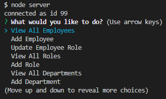

# employee_tracker

## 4/27/21

This application runs in node and allows the user to manage an company database. Employees, roles, and departments can be viewed or added using the command line. Individual employee roles can also be updated. The repository contains schema to create and populate a database in SQL.

## Video Walkthrough

https://drive.google.com/file/d/10r3lveDHVvVw-s8UG5K54BhlzUkL6dJO/view

## Images of Application

